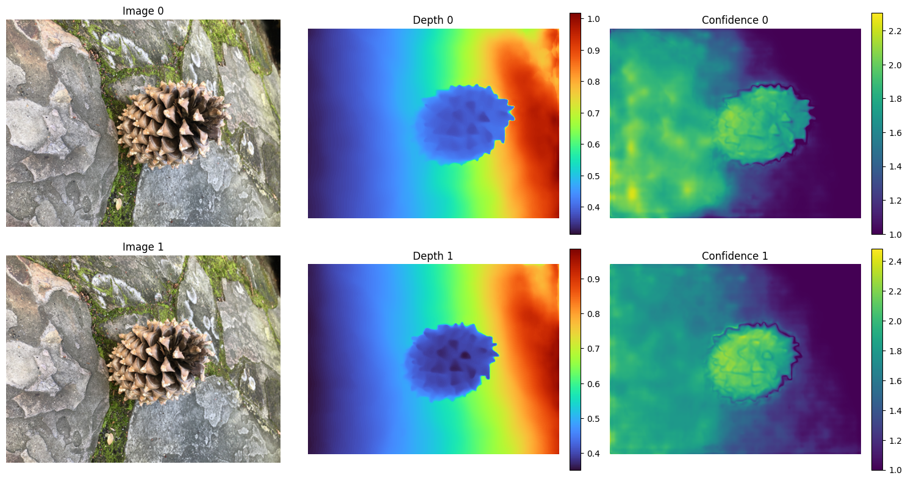
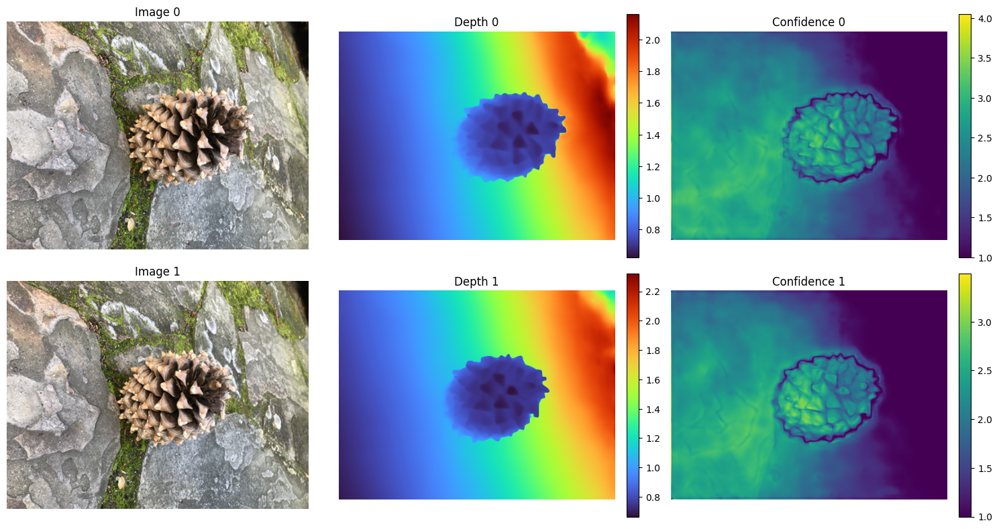
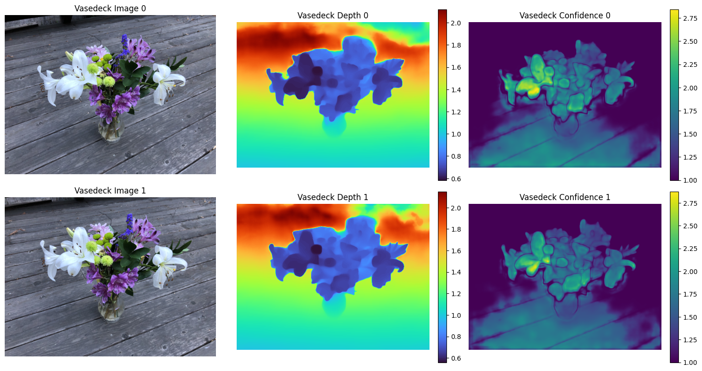

# 🎉 VGG‑T³: Offline Feed‑Forward 3D Reconstruction at Scale 🚀

<div align="center">
<h1>VGG‑T³</h1>
</div>


<a href="https://colab.research.google.com/github/1kaiser/vgg-ttt/blob/main/notebooks/reconstruct_jax_out.ipynb" target="_parent">
[](https://arxiv.org/abs/2602.23361) 
[](https://research.nvidia.com/labs/dvl/projects/vgg-ttt/) 
[](https://huggingface.co/nvidia/vgg-ttt)

🏛️ **Affiliations**: NVIDIA · University of Toronto · Vector Institute

## 📚 Overview
⏱️ VGG‑T³ processes large image collections **dramatically faster** than traditional feed‑forward methods (e.g., `< 1 min` for 1k images vs. `10 min` for VGGT).
🧠 It achieves this by replacing quadratic‑scaling softmax attention in global layers with a **linear test‑time‑training (TTT)** alternative.

## 🚀 Quick Start
```bash
# 🐍 Clone the repo and create a conda env:
conda create -n vggttt python=3.11 -y && conda activate vggttt

# 📦 Install dependencies (includes Jupyter/notebook support)
conda install -c conda-forge papermill jupytext -y
pip install -r requirements.txt
```

## 📦 JAX Inference – 💻 CPU/GPU, 💾 Low-RAM Mode
Run JAX-based inference on CPU/GPU using the converted memory-mappable weights:
```bash
JAX_PLATFORMS=cpu python -m vggttt_jax.run_inference_jax \
  --weights vggttt_jax/vggttt_f16.safetensors \
  --images data/nerf_real_360/pinecone/images_8/IMG_7238.png data/nerf_real_360/pinecone/images_8/IMG_7239.png \
  --device cpu \
  --precision bfloat16 \
  --low-ram
```
- 🎯 `--precision`: Choose `float32` or `bfloat16` compute precision.
- 💾 `--low-ram`: Enable eager CPU execution (no JIT) and memory-trimming to keep memory under **4 GB**.
- 🔌 `--device`: Select `cpu` (default) or `gpu` backend.

## 📓 Notebook Inference with Papermill & Jupytext
All notebooks live in `notebooks/` and have a paired `.py` source generated by [Jupytext](https://jupytext.readthedocs.io/).

### ⚛️ JAX Notebooks (`num_python` env)
The JAX-based reconstruction notebook supports low-RAM execution (which disables JIT, uses memory mapping, and processes inputs eagerly) and runs fully on CPU.

First, ensure the Jupyter kernel is registered:
```bash
conda run -n num_python python -m ipykernel install --user --name num_python --display-name "Python (num_python)"
```

Then run the notebook via Papermill:
```bash
# Run with default float16/bfloat16 low-RAM configuration on CPU
JAX_PLATFORMS=cpu conda run -n num_python papermill notebooks/reconstruct_jax.ipynb notebooks/reconstruct_jax_out.ipynb --kernel num_python
```

You can customize parameters via command line flags:
```bash
JAX_PLATFORMS=cpu conda run -n num_python papermill notebooks/reconstruct_jax.ipynb notebooks/reconstruct_jax_out.ipynb --kernel num_python \
  -p low_ram False \
  -p precision float32 \
  -y "image_paths:
- data/nerf_real_360/pinecone/images_8/IMG_7238.png
- data/nerf_real_360/pinecone/images_8/IMG_7239.png"
```

### 📐 3D Point Cloud Export (PLY / GLB)
The JAX notebooks automatically export the reconstructed 3D point clouds using **Trimesh** to the `assets/` directory:
- 🌲 **Pinecone**: [jax_pinecone_reconstruct.ply](assets/jax_pinecone_reconstruct.ply) & [jax_pinecone_reconstruct.glb](assets/jax_pinecone_reconstruct.glb)
- 🏺 **Vasedeck**: [jax_vasedeck_reconstruct.ply](assets/jax_vasedeck_reconstruct.ply) & [jax_vasedeck_reconstruct.glb](assets/jax_vasedeck_reconstruct.glb)

These standard files can be opened in Blender, MeshLab, or standard 3D viewers.

### 🖥️ CPU Notebooks (PyTorch – `num_gpu` env)
```bash
# 2-image CPU reconstruction
conda run -n num_gpu papermill notebooks/reconstruct_pinecone_cpu_2.ipynb notebooks/reconstruct_pinecone_cpu_2_out.ipynb

# 4-image CPU reconstruction
conda run -n num_gpu papermill notebooks/reconstruct_pinecone_cpu_4.ipynb notebooks/reconstruct_pinecone_cpu_4_out.ipynb
```

### ⚡ GPU Notebooks (PyTorch – `num_gpu` env)
```bash
# 2-image CUDA reconstruction
conda run -n num_gpu papermill notebooks/reconstruct_pinecone_cuda_2.ipynb notebooks/reconstruct_pinecone_cuda_2_out.ipynb

# 4-image CUDA reconstruction
conda run -n num_gpu papermill notebooks/reconstruct_pinecone_cuda_4.ipynb notebooks/reconstruct_pinecone_cuda_4_out.ipynb

# 6-image CUDA reconstruction
conda run -n num_gpu papermill notebooks/reconstruct_pinecone_cuda_6.ipynb notebooks/reconstruct_pinecone_cuda_6_out.ipynb
```

### 🔧 Custom image paths (base notebook)
```bash
conda run -n num_gpu papermill notebooks/reconstruct.ipynb notebooks/reconstruct_out.ipynb \
  -p device cuda \
  -y "image_paths:
- /path/to/image1.png
- /path/to/image2.png"
```

### 📝 Convert notebooks ↔ Python scripts
```bash
# Notebooks → Python scripts
for nb in notebooks/*.ipynb; do jupytext --to py:percent "$nb"; done

# Python scripts → Notebooks
for py in notebooks/*.py; do jupytext --to ipynb "$py"; done
```
Run the notebooks in either the **GPU** (`num_gpu`) or **CPU** (`num_python`) Conda environments as required.

## 🌐 TFLite / Browser (WebGPU) Inference

`vggttt_jax/convert_to_tflite.py` converts the JAX/Flax model to TFLite via
`jax2tf` → TF SavedModel → `TFLiteConverter`, fixed at a (2, 392, 518)
input shape (the exact shape the repo's own pinecone example resolves to).
`notebooks/reconstruct_dual_backend.ipynb` runs the same reconstruction via
both the JAX (`.safetensors`) and TFLite backends side by side and compares
them — verified working both locally (papermill) and on a real Colab CPU
session via `colab exec -f`. If testing this notebook via
[google-colab-cli](https://pypi.org/project/google-colab-cli/) yourself,
note that `colab exec` defaults to `--timeout 30` (seconds) for waiting on
a cell's reply — far shorter than this notebook's ~260s JAX cell — which
causes a harmless client-side `TimeoutError: Timeout waiting for reply`
even though the underlying kernel execution completes correctly. Pass
`--timeout 550` (or similar) explicitly to see a single `colab exec` call
run the whole notebook through to completion.

### Three TFLite variants, and why only one is usable in a browser

| Variant | Size | Runs via `tf.lite.Interpreter` (Python)? | Runs via LiteRT.js (browser)? |
|---|---|---|---|
| float32 | 4.6 GB | ✅ exact match to JAX | ❌ exceeds LiteRT.js's documented 2GB WASM memory ceiling |
| float16 | 2.3 GB | ✅ tiny error (cos sim 1.0) | ❌ still exceeds the 2GB ceiling |
| dynamic-range (weight-only int8) | 1.3 GB | ✅ real but modest error (~6% relative error in focal length; cosine similarity 0.997–0.9999 across all outputs) | ❌ **XNNPACK — which both the `wasm` accelerator and the CPU-fallback portion of `webgpu` depend on — does not support dynamic-range quantization at all** (a documented XNNPACK limitation, not a bug): `ERROR: failed to create XNNPACK runtime` |
| int8 (calibrated, full-integer) | — | ❌ conversion itself fails | — |

The int8 (calibrated) attempt fails at conversion time with `'stablehlo.scatter' op is not any of a builtin TFLite op, a flex TensorFlow op or a custom TensorFlow op` — the MLIR quantizer can't rewrite a `scatter` op used somewhere in the model, unrelated to bit-width. int4 was not attempted for the same reason: it would route through the identical MLIR quantization pass and hit the same wall.

**Net result: there is no quantization mode that is simultaneously small enough for LiteRT.js's browser memory ceiling *and* compatible with XNNPACK.** `webgpu_demo/index.html` is built and does correctly download/compile the dynamic-range model (proving the *size* problem is solved), but inference itself currently fails in-browser due to the XNNPACK incompatibility above. This is a genuine, verified constraint of the current LiteRT.js/XNNPACK stack for a model this size and architecture — not something fixable from the demo side. `reconstruct_dual_backend.ipynb`'s TFLite backend runs fine, since the Python `tf.lite.Interpreter` doesn't have this restriction.

### Weights are hosted as HF Hub **models**, not datasets

`vggttt_f16.safetensors`, `vggttt_f16.tflite`, and `vggttt_dynrange.tflite`
live at [huggingface.co/1kaiser/vgg_ttt](https://huggingface.co/1kaiser/vgg_ttt)
(model repo). This was migrated from an earlier dataset-type repo of the
same name (HF doesn't support converting a repo's type in place — this
meant downloading everything and re-uploading to a new model-type repo,
then deleting the old one). The same migration was done for the separate,
larger `vggt_omega_1b_512` checkpoint family (17.3GB across 2675 files,
multiple precision/format variants) at
[huggingface.co/1kaiser/vggt-omega-jax](https://huggingface.co/1kaiser/vggt-omega-jax).

## 📂 Repository Layout
```
├─ data/                # Datasets (e.g., nerf_360)
├─ notebooks/           # Jupyter notebooks + .py scripts (Jupytext)
├─ scripts/             # Utility scripts (weight conversion, etc.)
├─ vggttt_jax/          # JAX model implementation & inference runner
├─ vggttt/              # Original PyTorch implementation
├─ tests/               # Test suite & debugging helpers
├─ README.md            # ✨ This file
└─ ...
```

## 📊 Performance & Reconstruction Comparison

We benchmarked the VGG‑T³ reconstruction pipeline using 2 images from the `pinecone` dataset on a high‑core CPU server with the following configurations:

### 📈 Tabular Statistics

| Framework & Backend | Precision | JIT Mode | Peak RAM (RSS) | Inference Time | Total Time | Output Points |
| :--- | :---: | :---: | :---: | :---: | :---: | :---: |
| **PyTorch (CUDA)** | float32 | Eager | **2.05 GB** | **0.80 s** | **10.86 s** | 274,789 |
| **PyTorch (CPU)** | float32 | Eager | **5.73 GB** | **5.53 s** | **14.85 s** | 275,304 |
| **JAX (CPU - JIT)** | float32 | Compiled | **~9.50 GB** | **34.07 s** (first run) | **39.50 s** | 300,165 |
| **JAX (CPU - Low-RAM)** | bfloat16 | Eager | **5.66 GB** | **88.40 s** | **94.72 s** | 300,165 |

> [!NOTE]
> JAX low‑RAM mode strictly avoids the massive memory spikes associated with JIT compilation of 1B+ parameter models on CPU. The loading phase uses **memory-mapped `safetensors`** to stream parameters directly into JAX one-by-one, keeping loading memory low.

### 🖼️ Reconstruction Output Comparison

Here are the output visualizations (original images, depth maps, and confidence maps) generated from the notebooks:

#### 1. Pinecone Dataset (PyTorch CUDA Reference)


#### 2. Pinecone Dataset (JAX Low-RAM CPU Inference)


#### 3. Vasedeck Dataset (Alternative Pair - JAX Low-RAM CPU Inference)


## 📊 Evaluation & Demo
See `vggttt/evaluation/README.md` for reproducing paper results. The interactive demo can be launched with:
```bash
python vggttt/demo.py
```

## 🙏 Acknowledgements
We thank the open‑source community:
- [VGGT](https://github.com/facebookresearch/vggt)
- [Pi3](https://github.com/yyfz/Pi3)
- [CUT3R](https://github.com/CUT3R/CUT3R)
- [MapAnything](https://github.com/facebookresearch/map-anything)
- [LaCT](https://github.com/a1600012888/LaCT)

## 📖 Citation
```bibtex
@inproceedings{elflein2026vggttt,
  title     = {VGG‑T\textsuperscript{3}: Offline Feed‑Forward 3D Reconstruction at Scale},
  author    = {Elflein, Sven and Li, Ruilong and Agostinho, Sérgio and Gojcic, Zan and Leal‑Taixé, Laura and Zhou, Qunjie and Osep, Aljosa},
  booktitle = {Proceedings of the IEEE/CVF Conference on Computer Vision and Pattern Recognition (CVPR)},
  year      = {2026}
}
```

## 📄 License
The code is released under the NVIDIA OneWay Non‑commercial License. See `LICENSE` and `THIRD_PARTY_LICENSES.md` for details.
